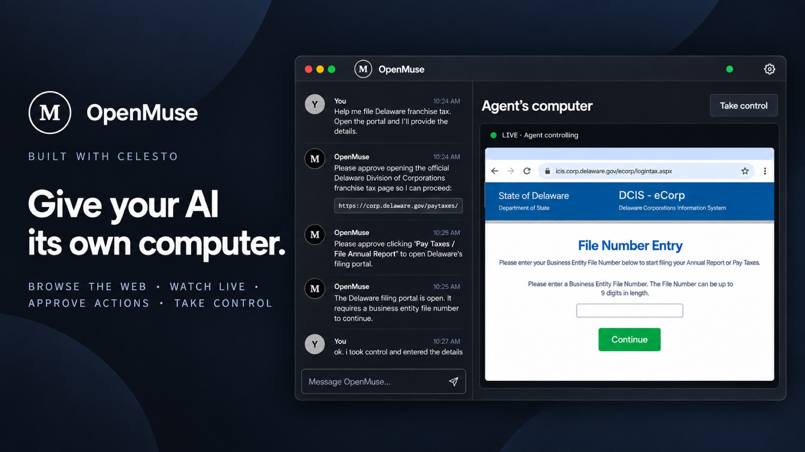

<div align="center">

# Celesto AI

## Give AI agents secure, persistent computers



### [Try OpenMuse](./open-muse/README.md)

<p align="left">OpenMuse is an open-source computer coworker that can browse the web, use apps, and keep working in the background — even when your laptop is off. <b>OpenMuse is powered by Celesto</b></p>


</div>

---

<div align="center">


[](https://github.com/CelestoAI/SmolVM/actions/workflows/github-code-scanning/codeql)
[](https://github.com/CelestoAI/SmolVM/actions/workflows/pytest.yml)
[](https://opensource.org/licenses/Apache-2.0)
[](https://www.python.org/downloads/)

[Quick start](#quickstart) • [Examples](#examples) • [Features](https://docs.celesto.ai/smolvm/features) • [Performance](#performance) • [Docs](https://docs.celesto.ai) • [Discord](https://discord.gg/KNb5UkrAmm)

</div>

---

Celesto gives AI agents their own secure and persistent computer.
Each microVM boots in milliseconds, runs any code or software you throw at it, persists files and state across sessions, and disappears when you're done — ready to handle thousands of sandboxes in production.

<br>

<table>
<tr>
<td width="50%" valign="top">
<p> <strong>Sub-second boot</strong></p>
<p>Your agent has a running VM before the API call returns (~500&nbsp;ms). No waiting for provisioning or image pulls.</p>
<p><a href="#performance">Read more →</a></p>
</td>
<td width="50%" valign="top">
<p> <strong>Hardware isolation</strong></p>
<p>Each sandbox runs in its own virtual machine with hardware-level separation. Untrusted code can't escape or access your host.</p>
<p><a href="#security">Read more →</a></p>
</td>
</tr>
<tr>
<td width="50%" valign="top">
<p> <strong>Network controls</strong></p>
<p>Turn outbound access off or limit it to specific IP addresses on Linux Firecracker.</p>
<p><a href="#network-controls">Read more →</a></p>
</td>
<td width="50%" valign="top">
<p> <strong>Browser sandbox</strong></p>
<p>Give agents a full browser inside the sandbox. Navigate, click, fill forms, and watch it live in your own browser.</p>
<p><a href="#browser-sandbox">Read more →</a></p>
</td>
</tr>
<tr>
<td width="50%" valign="top">
<p> <strong>File sharing</strong></p>
<p>Share local directories with the sandbox, read-only or writable. Agents work on your real codebase without copying files around.</p>
<p><a href="#mount-host-directories">Read more →</a></p>
</td>
<td width="50%" valign="top">
<p> <strong>Snapshots</strong></p>
<p>Pause a sandbox and resume it later with everything intact — memory, disk, and running processes.</p>
<p><a href="https://docs.celesto.ai/smolvm/features/snapshots">Read more →</a></p>
</td>
</tr>
<tr>
<td width="50%" valign="top">
<p> <strong>Coding agents</strong></p>
<p>One command to launch a sandbox with Claude Code, Codex, or Pi pre-installed and git credentials forwarded.</p>
<p><a href="#coding-agents">Read more →</a></p>
</td>
<td width="50%" valign="top">
<p> <strong>Windows sandbox</strong></p>
<p>Boot a Windows 11 guest and drive it from Python — PowerShell, file upload, env vars. Linux host only for now.</p>
<p><a href="#windows-sandbox">Read more →</a></p>
</td>
</tr>
</table>


## Use cases

- **Run untrusted code safely.** Execute AI-generated code in an isolated sandbox instead of on your machine.
- **Give agents a browser.** Spin up a full browser sandbox that agents can see and control in real time.
- **Let agents read your project.** Mount a local directory so agents can explore your codebase inside a sandbox.
- **Keep state across turns.** Reuse the same sandbox throughout a multi-step workflow.


## Quickstart

Install the Celesto alpha with Python 3.11 or newer:

```bash
pip install 'celesto==0.0.15a0'
```

Then prepare your machine and check that it is ready:

```bash
celesto setup
celesto doctor
```

<details>
<summary>Installation details</summary>

On supported Linux and macOS systems, installing `celesto` also pulls in the matching `smolvm-core` wheel automatically. The `smolvm-core` package name is unchanged. Most users do not need Rust installed.

Linux may prompt for `sudo` during setup so it can install host dependencies and configure runtime permissions.

For golden-AMI builds, two-stage deploys, pinning the Firecracker version, and other non-default install paths, see [docs/installation.md](docs/installation.md).

</details>

### Start a sandbox in Python

```python
from celesto import Computer

with Computer() as comp:
    result = comp.run("echo 'Hello from the sandbox!'")
    print(result.stdout)
```

The Python package is now named `celesto`; import from `celesto` as shown above.
Old `smolvm` Python imports are no longer supported.
Use `celesto setup` and `celesto doctor` to prepare your machine.

The computer is deleted when the `with` block ends, including when your code
raises an exception. Computers run on your machine by default, without a cloud account.
Outside `with`, call `delete()` yourself; automatic expiry after a crash is not
implemented yet.

To keep a computer after Python exits, create it with
`Computer(lifetime="persistent")`, save its `id` after the first
command, and reconnect with `Computer.get(id)`. Persistent computers
cannot be used in a `with` block. Remove them with `delete()` or
`celesto sandbox delete <id>`.

Advanced local APIs are available as `celesto.Celesto` and `celesto.CelestoManager`.
Existing local data, environment settings, and image caches retain their current
locations. Use the `celesto` command; the `smolvm` command is no longer installed.

To run in Celesto Cloud, set `CELESTO_API_KEY` in your environment, then select
the cloud explicitly:

```python
from celesto import Computer

with Computer(provider="cloud") as comp:
    print(comp.run("echo 'Hello from the cloud!'").stdout)
```

Cloud creation and commands can incur charges. Missing credentials raise an
error; they never switch execution to your machine. See [Python cloud usage](docs/python-cloud.md)
for connection options, persistence, and cleanup limits.

For code that always uses one location, import `LocalComputer` or `CloudComputer`
as `Computer`. Both expose the same operations and keep that location when you
reconnect. See the [migration guide](docs/local-first.md) for the changed default.

### Open an interactive terminal

Use `terminal()` when a person needs to work directly inside the computer. The
same API works locally and in Celesto Cloud.

```python
with Computer() as comp:
    terminal = comp.terminal()
    terminal.attach()
```

Press Ctrl+] to detach from a cloud terminal without ending its shell. Save
`terminal.terminal_id` to reattach later while both the cloud computer and
terminal session still exist. Local terminals do not support reattachment.

### Start a sandbox in TypeScript (alpha)

The TypeScript SDK gives Node.js agents a disposable computer on the same machine. It starts the local runtime automatically, so there is no server command or cloud credential to configure.

The separate TypeScript preview still uses the `@celestoai/smolvm` package and
`SmolVM` class. Set `runtimePath: "celesto"` to use this Python release.

The alpha supports Node.js 20.4 or newer on Linux x64 and Apple Silicon macOS. After installing Celesto above, install the preview package and `tsx`:

```bash
pip install 'celesto[server]==0.0.15a0'
npm install https://github.com/CelestoAI/SmolVM/releases/download/typescript-v0.1.0-preview.1/celestoai-smolvm-0.1.0-preview.1.tgz
npm install --save-dev tsx
```

```ts
import { SmolVM } from "@celestoai/smolvm";

async function main() {
  const smolvm = new SmolVM({ runtimePath: "celesto", onEvent: (event) => console.log(event.type) });
  const sandbox = await smolvm.sandboxes.create({ network: { mode: "off" } });

  try {
    await sandbox.files.write("/workspace/input.txt", "hello");
    const result = await sandbox.exec(
      ["sh", "-c", "tr a-z A-Z < /workspace/input.txt"],
      { timeoutMs: 30_000 },
    );
    console.log(result.stdout);
  } finally {
    await smolvm.close();
  }
}

main().catch((error) => { console.error(error); process.exitCode = 1; });
```

Run it with `npx tsx quickstart.ts`. See the [TypeScript guide](docs/typescript/index.md) for files, network rules, cancellation, diagnostics, CI, and the current alpha limits.

For a free-flow chat experience with a live computer pane, try [OpenMuse](open-muse/README.md). It uses Pi and an ephemeral, open-network browser with approval-gated interactions. An offline fixture mode is available for deterministic testing without a real account.

For a structured workflow, try [OpenMuse Research](examples/open-muse-research/README.md). It researches a three-day trip in a temporary VM and exports a sourced itinerary, budget, and ZIP packet.

### Start a sandbox from the CLI

Create a sandbox, check that it's running, then stop it:

```bash
celesto sandbox create --name my-sandbox
# my-sandbox  running  172.16.0.2

celesto sandbox list
# NAME         PRESET  STATUS   PID
# my-sandbox   -       running  12345

celesto sandbox stop my-sandbox
```

Open a shell inside a running sandbox:

```bash
celesto sandbox shell my-sandbox
```

Use `celesto sandbox ssh my-sandbox` when you specifically need an SSH session.

Run a single command in a running sandbox without opening a shell — useful in scripts. Put the command after `--`, and add `--start` if you want a stopped sandbox started first:

```bash
celesto sandbox exec my-sandbox -- python --version
```

If something goes wrong, read the sandbox's logs (add `--follow` to watch them live):

```bash
celesto sandbox logs my-sandbox
```

Tip: turn on tab completion so your shell can finish commands and sandbox names for you — run `celesto completion bash --install` (or `zsh`, `fish`) once. See the [CLI reference](docs/reference/cli.md#shell-completion) for details.

## macOS desktop sandbox (preview)

On an Apple Silicon Mac, Celesto can open a temporary macOS desktop for testing apps and installers without changing your everyday system. The first run downloads macOS from Apple and prepares a reusable local image.

```bash
celesto setup --macos
```

Create the desktop sandbox:

```bash
celesto sandbox create --os macos --name test-mac
# Next: celesto sandbox desktop test-mac
```

Open it in the built-in Screen Sharing app:

```bash
celesto sandbox desktop test-mac
```

Image preparation needs about 50 GB and 20–40 minutes. macOS images stay on the Mac that created them, and at most two macOS guests can run at once. See the [macOS desktop guide](docs/guides/macos.md) for shared folders, limits, and cleanup.

## Windows sandbox

Celesto can boot a Windows 11 guest as well as Linux. Hand it a Windows image and you get the same Python and CLI you use for Linux — run PowerShell, upload files, set environment variables, and run many sandboxes in parallel from one baseline image.

```python
from celesto import Celesto

with Celesto(
    os="windows",
    image="~/.smolvm/images/win11.qcow2",
    ssh_user="smolvm",
    ssh_password="smolvm",
) as vm:
    print(vm.run("Write-Output 'hello from windows'").stdout)
```

Build your own image from a Windows ISO:

```bash
celesto windows build-image --iso ./Win11.iso \
    --virtio-win-iso ./virtio-win.iso \
    --output ~/.smolvm/images/win11.qcow2
```

Windows guests need a Linux host with KVM. Host mounts, network controls, and snapshots are Linux-only today. See the full [Windows guide](https://docs.celesto.ai/smolvm/guides/windows-guests) for details.


## Coding agents

It sucks to “press enter and accept changes” every few seconds while using coding agents. Celesto makes it easy to isolate the agent coding environment from the host (laptops).

Start any supported coding agent in its own sandbox:

Video tutorial:

<a href="https://youtu.be/j1qyrTsI0Jw"></a>

```bash
celesto codex start
celesto claude start
celesto pi start
celesto hermes start
celesto opencode start
celesto openclaw start --name openclaw-work --no-attach
```

OpenClaw also has a private browser dashboard. Open it after the named sandbox starts:

```bash
celesto openclaw list
# NAME              STATUS   PID
# openclaw-work     running  12345

celesto openclaw open-ui openclaw-work
```

Creating an OpenClaw sandbox currently takes several minutes while Celesto installs its supported Node.js runtime and pinned OpenClaw release. See the [OpenClaw guide](docs/guides/agent-presets.md#open-openclaws-dashboard) for credentials, the dashboard flow, and safe steps for replacing an older sandbox.


## Browser sandbox

Celesto can also start a full browser inside a sandbox. This is useful when agents need to navigate websites, fill out forms, take screenshots, or connect through VNC.

Start a visible browser sandbox from Python:

```python
from celesto import Celesto

with Celesto.browser(headless=False) as browser:
    print(browser.cdp_url)  # Automation endpoint for Playwright or CDP tools
    print(browser.viewer_url)  # Web URL you can open to watch live
    print(browser.display_url)  # VNC URL for clients or computer-use agents
```

Use `browser.cdp_url` when a browser automation tool needs a Chromium DevTools
connection address. Use `browser.viewer_url` when you want to watch the session
in your own browser. Use `browser.display_url` when a VNC client or
computer-use agent needs to control the screen.

Start the same browser sandbox from the CLI:

```bash
celesto browser start --live
# Sandbox: browser-a1b2c3d4
# Viewer URL: http://127.0.0.1:36080/vnc.html?autoconnect=1&resize=scale  # open in a browser
# Display URL: vnc://127.0.0.1:35900                                      # give to a VNC client or agent
```

Use `Celesto.browser(headless=True)` for browser automation only; it gives you
`cdp_url` and no visible viewer. Use `Celesto.browser(headless=False)` for a
visible browser; it gives you `cdp_url`, `viewer_url`, and `display_url`. A
browser sandbox is still a focused Chromium environment, not a general desktop.

Open the viewer URL to watch the browser in real time, or give the display URL to a computer-use agent or VNC client. When you're done, list and stop sandboxes:

```bash
celesto browser list
celesto browser stop sess_a1b2c3
```

See [examples/browser_sandbox.py](examples/browser_sandbox.py) for a complete Python example.


## Linux computer

Use a Linux computer when an agent needs a visible desktop with more than a browser. The built-in template includes Chromium, a terminal, a file manager, and a text editor.

During this preview, the first computer start builds its image locally and requires Docker. Later starts reuse the cached image.

```python
from celesto import Celesto

with Celesto.computer() as computer:
    print(computer.display.viewer_url)
    print(computer.browser.cdp_url)
    computer.files.write("/workspace/task.txt", "Review this file")
    print(computer.run("ls -la /workspace").stdout)
```

The API groups the screen under `computer.display` and Chromium under `computer.browser`. If Chromium is closed while the desktop remains open, call `computer.browser.launch()`.

From the CLI:

```bash
celesto computer start --name assistant
celesto computer open assistant
celesto computer delete assistant
```

Choose a normal sandbox for command-only work, a browser sandbox for web-only automation, and a Linux computer for work across desktop applications. See the [Linux computer guide](docs/guides/computers.md) for Python and TypeScript examples.


## Network controls

Sandboxes have internet access by default. On Linux with Firecracker, turn outbound access off while keeping commands and file transfers available through a direct connection (`vsock`):

```python
from celesto import Celesto

with Celesto(
    backend="firecracker",
    comm_channel="vsock",
    internet_settings={"mode": "off"},
) as vm:
    print(vm.run("echo hello").stdout)
```

Use `mode="restricted"` with `allowed_cidrs` to allow specific IPv4 addresses or ranges. These modes require private networking and do not support shared folders or exposed ports. Command output and explicit file downloads still work when outbound access is off.

Existing `allowed_domains` lists allow the IP addresses found during setup; they do not verify the hostname on each connection. DNS servers are not automatically allowed.

See the [networking guide](docs/guides/networking.md) for a restricted-access example and supported configurations.


## Mount host directories

You can give a sandbox access to a folder on your machine. This is useful when an agent needs to work with an existing project without copying files back and forth.

```bash
celesto sandbox create --name my-sandbox --mount ~/Projects/my-app
celesto sandbox shell my-sandbox
ls /workspace   # your host files appear here
```

By default the host folder is read-only — the sandbox can read every file, but changes stay inside the sandbox and never touch the originals. If the agent creates or edits files under `/workspace`, those changes live only in the VM's overlay layer.

Mount at a custom path, or mount multiple directories:

```bash
celesto sandbox create --mount ~/Projects/my-app:/code --mount ~/data:/mnt/data
```

When you do want the sandbox to edit your host files, add `--writable-mounts`:

```bash
celesto sandbox create --mount ~/Projects/my-app --writable-mounts
```

Every directory passed with `--mount` becomes writable; writes from the guest are visible on the host immediately. The flag applies to all mounts on that command, so don't pair a folder you want the sandbox to modify with one you want kept untouched.

The same works from Python:

```python
from celesto import Celesto

with Celesto(mounts=["~/Projects/my-app"], writable_mounts=True) as vm:
    vm.run("echo hello > /workspace/from-sandbox.txt")
```

## Upload a file

You can copy one file into a running sandbox without mounting a whole folder.
This is useful when an agent needs a config file, script, or small input file.

```bash
# Copy a file from your machine into the sandbox.
celesto sandbox file upload my-sandbox ./prompt.txt /tmp/prompt.txt

# Open a shell in the sandbox to confirm the file is there.
celesto sandbox shell my-sandbox
# Then, inside the sandbox shell:
cat /tmp/prompt.txt
```

For a temporary, one-shot sandbox, the same works from Python. The sandbox
and uploaded file are deleted when the context exits:

```python
from celesto import Celesto

with Celesto() as vm:
    vm.upload_file("./prompt.txt", "/tmp/prompt.txt")
```

The destination must be an absolute path inside the sandbox (starting
with `/`), and any existing file at that path is overwritten.


## Examples

### Getting started

| What you'll learn | Example |
| --- | --- |
| Run code in a sandbox | [quickstart_sandbox.py](examples/quickstart_sandbox.py) |
| Start a browser sandbox | [browser_sandbox.py](examples/browser_sandbox.py) |
| Pass environment variables into a sandbox | [env_injection.py](examples/env_injection.py) |

### Agent framework integrations

These examples show how to wrap Celesto as a tool for popular agent frameworks, so an AI model can run shell commands or drive a browser through your sandbox.

| Framework | Example |
| --- | --- |
| OpenAI Agents | [openai_agents_tool.py](examples/agent_tools/openai_agents_tool.py) |
| LangChain | [langchain_tool.py](examples/agent_tools/langchain_tool.py) |
| PydanticAI — shell tool | [pydanticai_tool.py](examples/agent_tools/pydanticai_tool.py) |
| PydanticAI — reusable sandbox across turns | [pydanticai_reusable_tool.py](examples/agent_tools/pydanticai_reusable_tool.py) |
| PydanticAI — browser automation | [pydanticai_agent_browser.py](examples/agent_tools/pydanticai_agent_browser.py) |
| Computer use (click and type) | [computer_use_browser.py](examples/agent_tools/computer_use_browser.py) |

### Advanced

| What it does | Example |
| --- | --- |
| Install and run OpenClaw 2026.9.1 inside a Debian sandbox with a 4 GB root filesystem | [openclaw.py](examples/openclaw.py) |

Each script shows its own `pip install ...` line when it needs extra packages.


## Security

Celesto automatically trusts new sandboxes on first connection to keep setup simple. This is safe for local development, but you should not expose sandbox network ports publicly without extra controls. See [SECURITY.md](SECURITY.md) for the full policy and scope.


## Performance

Celesto ships a benchmark suite that measures the timings AI agents actually feel: cold start, time-to-interactive, pause/resume, and snapshot create/restore. It drives the public Python SDK on whichever backend is native to your host — Firecracker on Linux, QEMU on macOS.

Run it locally:

```bash
uv run python scripts/benchmarks/bench.py
```

See [scripts/benchmarks/README.md](scripts/benchmarks/README.md) for flags, output format, and what each metric means.


## Contributing

See [CONTRIBUTING.md](CONTRIBUTING.md) to get started.


## License

Apache 2.0 — see [LICENSE](LICENSE) for details.

---
<div align="center">
Built with 🧡 in London by <a href="https://celesto.ai">Celesto AI</a>
</div>
