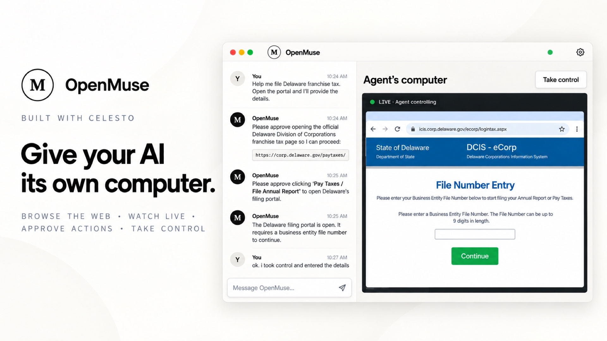

# OpenMuse

<picture>
  <source media="(prefers-color-scheme: dark)" srcset="./banner-dark.png">
  <source media="(prefers-color-scheme: light)" srcset="./banner-light.png">
  
</picture>

OpenMuse is an open-source computer coworker that browses public websites in its own disposable Linux desktop. Tell it what you want in chat, watch the computer work, approve actions that change a page, and take control whenever you need to enter something yourself.

> [!IMPORTANT]
> OpenMuse is a source-checkout preview for local development. Its current open-network mode is not yet a hardened boundary for browsing untrusted websites.

## What you can do

- Ask OpenMuse to research or work through a public website without a site-specific integration.
- Watch the isolated desktop beside the conversation.
- Review navigation, clicks, form changes, and keypresses before they run.
- Take control of the desktop for private or human-only steps.
- Expand **Run details** to inspect the agent's tool calls, observations, approvals, timing, and failures.

## Quick start

OpenMuse runs from this SmolVM repository. The supported hosts are Linux x64 and Apple Silicon macOS.

Before you start, install:

- Node.js 22.19 or newer
- An OpenAI API key

### 1. Prepare SmolVM

Install SmolVM, prepare your computer, and verify the setup with one command:

```bash
curl -sSL https://celesto.ai/install.sh | bash
```

The installer adds the Python tooling SmolVM needs, installs SmolVM, prepares the host, and runs its readiness check. See the [manual installation guide](../docs/installation.md) if the installer reports a problem.

Download and verify the desktop image now so the first task does not pause without terminal progress:

```bash
celesto image pull linux-desktop
```

The download is needed only once. Later runs reuse the local image.

### 2. Build the local TypeScript SDK

OpenMuse uses the unreleased SmolVM TypeScript package in `../ts`. Build it once from the repository root:

```bash
cd ts
npm ci
npm run build
```

### 3. Install OpenMuse

Move into the app directory and install its packages:

```bash
cd ../open-muse
npm ci
```

Create the local settings file. It points OpenMuse at the SmolVM runtime in this checkout:

```bash
test -f .env.local || cp .env.example .env.local
```

This keeps an existing local settings file unchanged.

### 4. Start the app

```bash
npm run dev
```

Wait for both ready messages:

```text
[client] Local: http://127.0.0.1:5174/
[server] OpenMuse is ready at http://127.0.0.1:4318
```

Open [http://127.0.0.1:5174](http://127.0.0.1:5174). Expand **Use an OpenAI API key**, enter your key, choose a model, and select **Start using OpenMuse**. The key stays in the local Node.js process and is not returned to the browser after setup.

You can instead set `OPENAI_API_KEY` in `.env.local` before starting the app. Do not commit that file.

### 5. Try the first task

Send:

> Open https://example.com and tell me what the page says.

OpenMuse will open the public page directly. Watch the disposable desktop start and Chromium open the site. A normal first boot can take longer than later boots while SmolVM prepares the downloaded image.

Try one more prompt after the page opens:

> Give me the raw page data as Markdown.

Click **Stop** when you are done. OpenMuse deletes the conversation's computer and clears its association for both providers. When the server exits without **Stop**, local SmolVM computers are deleted while Celesto Cloud computers stay linked so the next OpenMuse process can reconnect.

## Everyday controls

### Chats and model settings

Open **Chats** to start a new conversation or return to one of up to 50 saved local chats. Only the selected chat can use an agent or attached computer. With SmolVM, returning starts a fresh local computer only when needed. With Celesto Cloud, returning reconnects the computer saved with that conversation. **Reset conversation** permanently removes the selected transcript and computer after confirmation.

Select the current model in the header to open model settings. Use **Back to conversation** to return without changing it.

### Approvals

Reading, scrolling, public navigation, safe link opening, and search can run directly. Clicks, ordinary form changes, and keypresses require a one-time approval tied to the current page and exact action. Passwords, payment details, and verification codes require **Take control**. Approvals expire after five minutes and stop working if the page or target element changes.

### Take control

Select **Take control** when you need to use the desktop yourself. OpenMuse pauses while you control any open tab. Return control before sending another chat message.

### Run details

Every assistant turn has a collapsed **Run details** row. Expand it to see the tool inputs and results the model saw, along with approvals, timing, and failures. Traces stay in memory for the current conversation and exclude credentials and takeover-only input.

### Recovery after a restart

OpenMuse stores bounded chat history and the selected conversation in `.open-muse/state.json`. Celesto mode also stores the computer ID, but never API keys or short-lived browser/display connections. After a restart, OpenMuse reconnects that computer. If it no longer exists, the chat asks you to **Continue** with a fresh computer or **Start over**. An interrupted approved action is never replayed.

## Develop OpenMuse

Use fixture mode for the fastest edit-and-test loop. It replaces the public web with an in-memory store, so it needs no model, virtual machine, DNS request, or public internet access.

```bash
OPEN_MUSE_FIXTURE_STORE=1 npm run dev
```

Fixture mode restores the catalog-specific tools and checkout-review approval used by the original demo. Contributors and coding agents should continue with the [OpenMuse development guide](./DEVELOPMENT.md) for isolated state, project structure, checks, browser tests, and evaluations.

## Configuration

OpenMuse reads `.env.local` when the Node.js server starts.

| Variable | Default | Purpose |
| --- | --- | --- |
| `OPENAI_API_KEY` | unset | Uses an OpenAI API key without entering it in the app. |
| `OPENAI_MODEL` | `gpt-5.6-luna` | Selects the initial model when an environment API key is used. |
| `OPENMUSE_COMPUTER_PROVIDER` | `smolvm` | Uses local `smolvm` or hosted `celesto` computers. |
| `CELESTO_RUNTIME` | `celesto` | Chooses the Celesto command. `.env.example` points to the source-checkout wrapper. |
| `CELESTO_API_KEY` | unset | Required server-only credential when the computer provider is `celesto`. |
| `CELESTO_API_URL` | Celesto production API | Optional development or self-hosted Celesto control-plane URL. |
| `OPEN_MUSE_HOST` | `127.0.0.1` | Local bind address. Other addresses are rejected. |
| `OPEN_MUSE_PORT` | `4318` | Node.js server port. |
| `OPEN_MUSE_AUTH_PATH` | `.open-muse/auth.json` | Changes where saved provider credentials are stored. |
| `OPEN_MUSE_STATE_PATH` | `.open-muse/state.json` | Changes where conversation recovery state is stored. |
| `OPEN_MUSE_FIXTURE_STORE` | `0` | Set to `1` to use the offline fixture store. |
| `OPEN_MUSE_ENABLE_SUBSCRIPTION_AUTH` | `0` | Set to `1` only for the approved OpenAI account sign-in development smoke. |

Saved credentials are limited to the current operating-system user on macOS and Linux. OpenAI account sign-in remains behind a temporary release gate while provider terms are reviewed. Gemini account sign-in is hidden because the pinned Pi release does not expose that capability.

## Troubleshooting

### The app says it could not start a private computer

Run the runtime check from the repository root and follow its recovery message:

```bash
uv run celesto doctor
```

If the image download was interrupted, retry it from the repository root:

```bash
uv run celesto image pull linux-desktop
```

### The SmolVM TypeScript package cannot be resolved

Rebuild the local package, then restart OpenMuse:

```bash
cd ../ts
npm ci
npm run build
```

### Celesto Cloud is selected but does not start

Confirm `.env.local` selects Celesto and contains its API key:

```dotenv
OPENMUSE_COMPUTER_PROVIDER=celesto
CELESTO_API_KEY=your-key
```

OpenMuse uses `@celestoai/sdk` 0.1.6 or newer for browser and display connections. API keys and the short-lived connection URLs stay in the Node.js process and must not be printed or copied into saved state.

### The browser tests cannot find Chromium

```bash
npm run test:e2e:install
```

### A previous conversation appears during development

OpenMuse restores `.open-muse/state.json` by design. Use **Reset conversation**, or start the app with a separate `OPEN_MUSE_STATE_PATH`. Coding agents should use the isolated fixture-mode command above.

## How it works

The React client displays chat and the live desktop. A local Node.js server owns the model connection, credentials, approval checks, conversation state, and computer lifecycle. An OpenMuse-owned provider protocol selects local SmolVM or Celesto Cloud, while a host-owned Playwright connection sends approved browser operations to Chromium.

The model chooses structured operations and their arguments; it does not send executable Playwright code. New popups remain quarantined until the user adopts them. The browser automation address and raw remote-display address stay in the Node.js process, and the client receives only a short-lived path to the viewer.

An approved operation is recorded before it runs. A failure before dispatch appears as **Action did not run**. A timeout, crash, malformed result, or failure after dispatch appears as **Action outcome unknown**. Continuing asks the agent to inspect or ask before acting again; it never retries an uncertain operation automatically.

### Current security boundary

Structured navigation rejects local and private literal addresses, but the initial general-web implementation still uses SmolVM's open network mode. DNS and subresource enforcement need the approved public-only egress proxy before OpenMuse should be treated as hardened against untrusted websites.

## Contributing and help

- Read the repository [contribution guide](../CONTRIBUTING.md) before opening a pull request.
- [Report an OpenMuse bug](https://github.com/CelestoAI/SmolVM/issues/new?template=bug_report.yml) with reproduction steps and host details.
- [Propose a feature](https://github.com/CelestoAI/SmolVM/issues/new?template=feature_request.yml) before starting a large change.
- Report security problems privately through [GitHub Security Advisories](https://github.com/CelestoAI/SmolVM/security/advisories/new), not a public issue. See the [security policy](../SECURITY.md) for details.

Implementation maps and design documents are indexed in the [OpenMuse development guide](./DEVELOPMENT.md).
